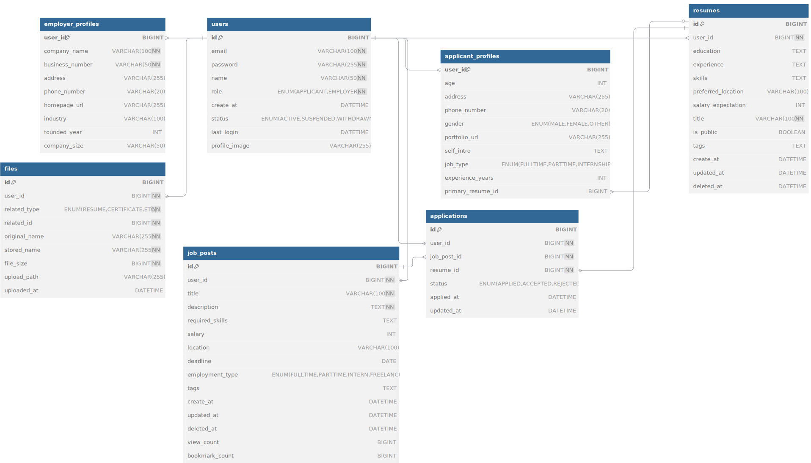

# 💼 HR Matching Service

지능형 검색 기반 HR 매칭 웹 서비스입니다.  
지원자는 이력서를 작성하고 원하는 채용공고에 지원할 수 있으며, 기업은 적합한 인재를 찾고 채용 프로세스를 관리할 수 있습니다.

[👉 프로젝트 링크](https://github.com/fullmoon1219/WIT_HR_Matching_Service.git)

---

## 🕒 개발 기간

**2025.06.16 ~ 2025.07 (예정)**

---

## 🧑‍💻 기술 스택

### ✅ Backend
- Java 17
- Spring Boot
- MyBatis
- Spring Security
- Java Mail Sender
- Validation
- Lombok

### ✅ Frontend
- HTML
- Thymeleaf

### ✅ Database
- MySQL

---

## 🔑 주요 기능

### 👥 공통 (지원자/기업 공통)
- 회원가입 (역할 선택: 지원자 / 기업)
- 로그인 / 로그아웃
- 마이페이지 (내 정보 및 활동 이력)
- 비밀번호 변경, 회원 탈퇴

### 🙋 지원자 기능
- 이력서 작성 / 수정 / 삭제
- 채용 공고 검색 (기술, 지역, 직무, 급여 등)
- 공고 상세 보기 및 지원
- 지원 내역 확인
- [v2.0] 스크랩 기능
- [v3.0] 자동 추천 기능 (AI 연계)

### 🏢 기업 기능
- 채용 공고 등록 / 수정 / 삭제
- 지원자 리스트 / 이력서 상세 보기
- 채용 결과 처리 (합격/불합격)
- [v2.0] 이력서 검색
- [v3.0] 인재 추천 기능 (AI 연계)

### ⚙️ 관리자 기능 (v2.0~)
- 회원 목록 관리 (정지/삭제 등)
- 부적절 공고 및 이력서 모니터링
- 통계 대시보드 (사용자 수, 공고 수 등)

---

## 🛠 데이터베이스 구조 (ERD)

### 주요 테이블

| 테이블 | 설명 |
|--------|------|
| `users` | 회원 정보 (공통) |
| `resumes` | 이력서 정보 (지원자 전용) |
| `job_posts` | 채용 공고 (기업 전용) |
| `applications` | 공고 지원 기록 |

### 📊 ERD (Entity Relationship Diagram)
> 

---

## 📌 DB 테이블 구조 (요약)

### `users`
| 필드명 | 타입 | 설명 |
|--------|------|------|
| id | BIGINT | 사용자 ID (PK) |
| email | VARCHAR(100) | 이메일 (UNIQUE) |
| password | VARCHAR(255) | 암호화된 비밀번호 |
| name | VARCHAR(50) | 이름 또는 기업명 |
| role | ENUM | APPLICANT / EMPLOYER |
| create_at | DATETIME | 가입일 |

### `resumes`, `job_posts`, `applications` 등은 [📄 전체 보고서](#) 참고

---

## 🔎 기능별 버전 계획

| 기능 | 버전 |
|------|-------|
| 기본 로그인 / 회원가입 / 공고 관리 | v1.0 |
| 파일 업로드 / 스크랩 / 관리자 기능 | v2.0 |
| AI 추천 / 실시간 채팅 등 고급 기능 | v3.0 |

---

## 📁 프로젝트 구조

```bash
📦 src
 ┣ 📂 main
 ┃ ┣ 📂 java/org/wip/hrmatching
 ┃ ┃ ┣ 📂 controller
 ┃ ┃ ┣ 📂 service
 ┃ ┃ ┣ 📂 dao
 ┃ ┃ ┣ 📂 vo
 ┃ ┃ ┗ 📂 config
 ┃ ┣ 📂 resources
 ┃ ┃ ┣ 📂 templates
 ┃ ┃ ┣ 📂 static
 ┃ ┃ ┗ 📜 application.yml
